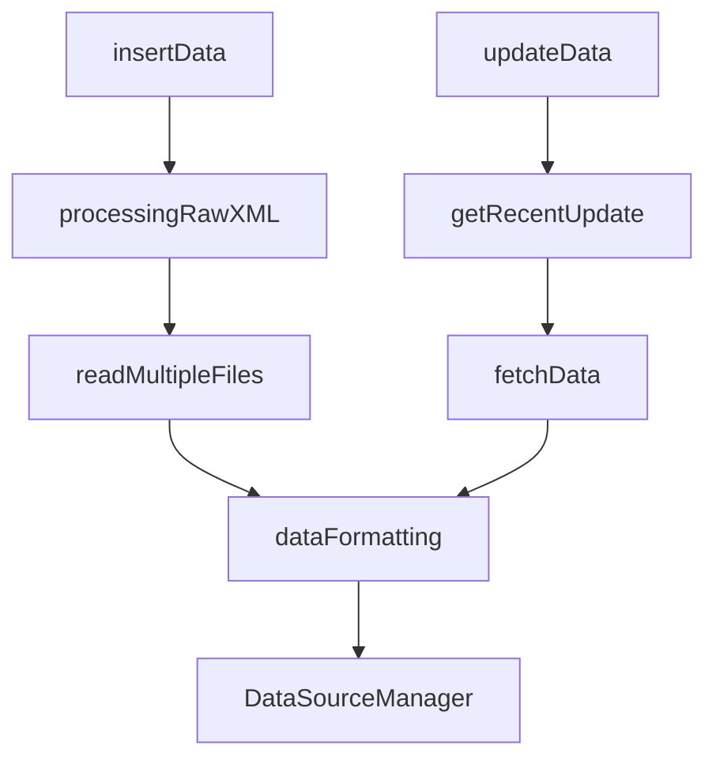

# 맛점: 위치 기반 맛집 추천 서비스

위치 기반 추천 기능으로 맛집을 찾아 맛있는 점심식사도 하고 평점도 매겨보세요.

## 개요

공공 데이터 API를 활용하여 서울 및 경기 지역의 음식점 정보를 제공하고, 사용자의 위치 정보를 기반으로 맛집을 추천하는 서비스입니다.
사용자는 맛집에 대한 상세정보를 확인하고, 맛집에 대한 리뷰를 작성할 수 있습니다.

- 사용자는 회원가입 및 로그인을 통해 서비스를 이용할 수 있습니다.
- 사용자는 위치 정보를 기반으로 주위 맛집을 추천받을 수 있습니다.
- 다양한 필터링 기능을 통해 맛집을 검색할 수 있습니다. (거리순, 평점순)
- 해당하는 맛집에 대한 상세 정보를 확인할 수 있습니다.
- 맛집에 대한 리뷰를 작성할 수 있습니다.

## 기술 스택

|                 | Stack                                                                                                                                                                                                                                                                                                               | Version                                           |
| --------------- | ------------------------------------------------------------------------------------------------------------------------------------------------------------------------------------------------------------------------------------------------------------------------------------------------------------------- | ------------------------------------------------- |
| **Runtime**     |                                                                                                                                                                                                           | v20.x.x                                           |
| **Language**    |                                                                                                                                                                                                     | v5.1.x                                            |
| **Framework**   |                                                                                                                                                                                                             | v10.x.x                                           |
| **Database**    |                                                                                             | PostgreSQL v16.4.x, PostGIS 3.4.x, TypeORM v0.3.x |
| **Environment** |                                                                                                            | npm v10.2.x                                       |
| **Test**        |                                                                                                                                                                                                                   | Jest v29.5.x                                      |
| **etc**         |    | N/A                                               |

## 설치 및 실행

```
npm run docker:prod
```

<br/>

## API 명세서

| 도메인     | 기능명           | HTTP Method | URL                          | 인증 | 담당자 |
| ---------- | ---------------- | ----------- | ---------------------------- | ---- | ------ |
| member     | 회원 가입        | POST        | /api/members/sign-up         | X    | 주소미 |
| member     | 로그인           | POST        | /api/members/sign-in         | X    | 주소미 |
| member     | 새 토큰 발급     | PATCH       | /api/members/auth/refresh    | O    | 주소미 |
| member     | 사용자 정보 조회 | GET         | /api/members/:id             | O    | 오다은 |
| member     | 사용자 정보 수정 | PATCH       | /api/members/:id/settings    | O    | 오다은 |
| restaurant | 맛집 목록 조회   | GET         | /api/restaurants             | O    | 김도연 |
| restaurant | 맛집 상세 조회   | GET         | /api/restaurants/:id         | O    | 김도연 |
| restaurant | 맛집 리뷰 생성   | POST        | /api/restaurants/:id/reviews | O    | 오다은 |

#### API 상세 문서

API에 대한 자세한 정보와 명세는 아래 링크를 통해 확인할 수 있습니다. 각 엔드포인트에 대한 설명과 예시가 포함되어 있습니다.

[](https://evening-cushion-319.notion.site/45110023f9484632b7dc638e4dd11d48?v=736563bd97434c1b9c6c124f4c25ecc7&pvs=4)

### 데이터 파이프라인

담당자: 김지수

- 공공 데이터 API를 활용하여 서울 및 경기 지역의 음식점 정보를 수집하고, 데이터베이스에 저장합니다.
- 일정한 주기로 데이터를 업데이트하여 최신 정보를 제공합니다.

<details>
  <summary>flow chart</summary>



</details>

## 프로젝트 관리

#### 프로젝트 팀 노션 링크

설계와 구현 과정에 대한 자세한 내용은 아래 프로젝트 노션 링크를 통해 확인할 수 있습니다.

[](http://evening-cushion-319.notion.site)

#### 팀 규칙 &코드 컨벤션

코드의 일관성을 유지하기 위해 특정 코드 컨벤션과 팀 규칙을 따르고 있습니다.
자세한 내용은 아래 노션 링크를 통해 확인할 수 있습니다.

[](https://evening-cushion-319.notion.site/9e36314df92e468b8285abd6b57217e8?pvs=25)

<details>
<summary><h4>커밋 메시지 컨벤션</h4></summary>

```
# (gitmoji) <타입> : <제목><이슈번호>

##### 제목은 이슈 번호와 함께 최대 50 글자까지 한 줄로 입력 ############## -> |

# 본문은 위에 작성
######## 본문은 한 줄에 최대 72 글자까지만 입력 ########################### -> |

# --- COMMIT END ---
# <타입> 리스트
#   ✨(:sparkles:) feat    : 기능 (새로운 기능)
#   🐛(:bug:) fix     : 버그 (버그 수정)
#   ♻(:recycle:) refactor : 리팩토링
#   💄(:lipstick:) style   : 스타일 (코드 형식, 세미콜론 추가: 비즈니스 로직에 변경 없음)
#   📝(:memo:) docs    : 문서 (문서 추가, 수정, 삭제)
#   ✅(:white_check_mark:) test    : 테스트 (테스트 코드 추가, 수정, 삭제: 비즈니스 로직에 변경 없음)
#   🔨(:hammer:) chore   : 기타 변경사항 (빌드 스크립트 수정 등)
# ------------------
#     제목은 명령문으로
#     제목 끝에 마침표(.) 금지
#     제목과 본문을 한 줄 띄워 분리하기
#     본문은 "어떻게" 보다 "무엇을", "왜"를 설명한다.
#     본문은 한 줄을 작성하고 . 마침표를 찍어서 분리한다.
# ------------------
```

</details>

<details>
<summary><h4>브랜치 전략</h4></summary>

| 브랜치 유형        | 브랜치 이름 | 설명                                                                         | **사용법**                                                                   |
| ------------------ | ----------- | ---------------------------------------------------------------------------- | ---------------------------------------------------------------------------- |
| **Main Branch**    | `main`      | 제품으로 출시될 수 있는 브랜치                                               | 사용자에게 배포 가능한 상태만을 관리하며, 배포(release) 이력을 관리합니다.   |
| **Develop Branch** | `dev`       | 다음 출시 버전을 개발하는 브랜치                                             | 모든 기능이 추가되고 버그가 수정된 후, `dev` 브랜치를 `main`으로 병합합니다. |
| **Feature Branch** | `feature/*` | 새로운 기능 개발 및 버그 수정이 필요할 때마다 `dev` 브랜치로부터 분기됩니다. | 개발이 완료되면 `dev` 브랜치로 merge 하여 다른 사람들과 공유합니다.          |

### 예시

- Feature 브랜치 명명 규칙: `feature/기능요약` (예: `feature/login-api`)

</details>

<br/>

<br/>

## 디렉토리 구조

<details>
<summary>프로젝트 디렉토리 구조</summary>

```bash
.
├── Dockerfiles # 도커 이미지 빌드를 위한 파일
│   ├── db
│   └── server
├── data-pipeline # 데이터 파이프라인
│   ├── data # xml files
│   └── src
│       ├── common # 공통적으로 쓰이는 함수, constants.
│       ├── entities # entity (restaurant만 있습니다)
│       ├── insert # 초기 데이터 insert 함수
│       ├── types # type 정의
│       └── update # api 요청하여 db update하는 함수
├── init.sql # postgis extension 추가 script
├── src # API server
│   ├── auth # 인증 모듈
│   │   ├── decorators
│   │   ├── guards
│   │   └── strategies
│   ├── config # 환경변수 설정
│   │   ├── cache
│   │   └── database
│   ├── database # seeding files
│   │   ├── factory
│   │   └── seeds
│   ├── entities
│   ├── members # 사용자 관련 API
│   │   └── dto
│   └── restaurants # 맛집 관련 API
│       └── dto
└── test

30 directories
```

</details>
<br/>

## Author

|  |  |  |  |
| :----------------------------------------------------------------------------------------: | :-------------------------------------------------------------------------------------: | :--------------------------------------------------------------------------------------: | :-------------------------------------------------------------------------------------: |
|                  김도연<br/>[@kimdoyeonn](https://github.com/kimdoyeonn)                   |                    김지수<br/>[@jis-kim](https://github.com/jis-kim)                    |                   오다은<br/>[@ooheunda](https://github.com/ooheunda)                    |                    주소미<br/>[@joosomi](https://github.com/joosomi)                    |
|                             맛집 목록 조회<br/>맛집 상세 조회                              |                       맛집 데이터 파이프라인<br/>Docker 환경 구성                       |                         사용자 정보 업데이트<br/>맛집 리뷰 생성                          |                       회원 가입<br/> 로그인 <br/> 인증 토큰 갱신                        |

```

```

```

```

```

```
